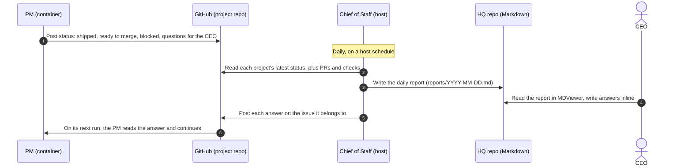

# Brainstorm: Communication channel

Oct 5, 2026 · CEO + PM · Status: Open

How the CEO, the Chief of Staff (CoS) and each project's PM talk to each other, including the daily report. This is the last open question in the [product brief](../product-brief.md).

**How to use this doc:** each question below has my recommendation. Write your answer under **CEO:**, the same way you did in the brief. Leave it blank to accept my recommendation. When you're done, I'll fold the results into the brief.

## Starting proposal

Everything goes through GitHub and Markdown files. Nothing reaches into a live agent session.

## A correction to my earlier claim

I said this design means the host never touches a container. That's only half true. Someone still has to **start** the PM so it can write its status and read your answers. The difference is:

- **One-shot headless runs** (the host runs one command in the container, and the PM does one task and exits). This is easy, and both `apple/container` and LXC can do it.
- **Live, interactive sessions** that the host has to broker. This is the hard part, and the proposal still avoids it.

That leads to the most important question in this brainstorm (Q1). It's now decided; see below.

## Questions

### Q1. What keeps the agents working when nobody is talking to them? ✅ Decided

**CEO:** The app (control plane) starts the container and opens an agent session in it to run the PM, probably over ssh. If there's no work to do, the PM ends and the container can be stopped. Solopreneurs with a single project might not use the control plane at all, so the PM inside the project should do more of the work.

**What this means for the design:**

1. **Two layers, and the bottom one works without the top.**
    - **Project kit** (inside each repo and container): the PM and the other roles, the issue and PR formats, and the GitHub gates. Someone with one project can run the PM directly and stop there.
    - **Control plane** (on the host, optional): multiple projects, container lifecycle, the Chief of Staff, the daily report.
2. **The PM runs the project.** Within a session, the PM picks the work, consults its subagents, and starts the Coder and reviewer sessions inside the container. The control plane never manages roles directly; it only starts the PM.
3. **Sessions are short, containers are disposable.** A PM session runs until there's nothing left to do: everything is done, waiting on a review, or waiting on the CEO. Then it posts a status update and exits, and the control plane stops the container. Any state that must survive lives on GitHub or on the container's persistent disk, never in a session.
4. **The non-goal holds as written.** No agents run when there's no work.

#### Q1a. Exec or ssh?

Both runtimes can run a command inside a container without ssh: `container exec` for `apple/container` and `lxc exec` for LXC. Exec means there's no ssh server or ssh keys in the container, so there's less to secure. ssh is only needed when the container runs on a **different machine** from the control plane, for example LXC on a Linux server while the control plane runs on your Mac.

**PM recommendation:** Use runtime exec when the container is local, and ssh only for containers on another machine. Both sit behind the same "run in project" interface.

**CEO:**

#### Q1b. What makes the control plane start a PM session?

The control plane only needs cheap GitHub checks (no LLM) to decide whether a project has work. It starts the PM when one of these happens:

- You answer a question for that project
- A PR is merged, so the next story can start
- A review or CI check finishes on an open PR
- The roadmap or an epic changes
- The daily report is due and the project's last status update is more than 24 hours old
- You start one by hand

**PM recommendation:** Accept this list. The host runs the checks every few minutes while the control plane is running. Without the control plane, you start the PM yourself.

**CEO:**

#### Q1c. What happens when a PM session ends with work in flight?

For example, the Coder is still running, or a review just started.

**PM recommendation:** The PM doesn't end while a Coder or reviewer session it started is still running. It waits for them, then decides again. The control plane stops the container only after the PM exits. Stopping isn't deleting: the disk, worktrees and caches persist until the project is archived.

**CEO:**

### Q2. Where does each PM post its status?

| Option | Trade-off |
| --- | --- |
| **A. A pinned "Status" issue per project, one comment per update** (recommended) | Keeps the roadmap issue clean, gives you a full history, easy for the CoS to find |
| B. Comments on the roadmap issue | One fewer issue, but status gets mixed with roadmap discussion |
| C. A `STATUS.md` file committed to the repo | Readable in your `main` mount, but every update is a commit, and it needs a PR or a bypass of the gates |

**PM recommendation:** A. Each update uses a fixed template: Shipped, Ready to merge, In progress, Blocked, **Questions for the CEO** (each with an ID such as `Q-3`), and Risks.

**CEO:**

### Q3. When does the PM post a status update?

**PM recommendation (updated after Q1):** The PM posts a status update at the end of every session, plus mid-session if a PR becomes ready to merge or it raises a question for you. Before the daily report, the control plane starts a session for any project whose last update is more than 24 hours old.

**CEO:**

### Q4. Does the CoS trust the PM's status?

**PM recommendation:** Trust but verify. The CoS checks what each PM claims against GitHub before putting it in the report. For example, a PR reported as "ready to merge" must have every required check passing, and "shipped" must match merged PRs. Anything that doesn't match goes in the report as a discrepancy.

**CEO:**

### Q5. How does the daily report reach you?

**PM recommendation:** The CoS writes `reports/YYYY-MM-DD.md` in a **private HQ repo** and commits it. The host opens it in MDViewer at a time you set. It runs on `launchd` on macOS and a `systemd` timer on Linux. The report puts **what needs you first** (merges and questions), then one section per project.

**CEO:**

### Q6. How do you answer, and how do the answers reach the PM?

The answer has to be verifiably **yours**. All agents share one bot identity, so if your answers were posted by the bot, any agent (including a prompt-injected one) could fake a "CEO decision".

| Option | Trade-off |
| --- | --- |
| **A. Answer inline in the report, then the host posts the answers under your GitHub account** (recommended) | Same workflow you used on the brief. A plain script posts your text word for word, not an LLM. PMs treat only comments from your account as decisions |
| B. Tell the CoS in chat, and it posts for you | Convenient, but an LLM is then writing words in your name |
| C. Answer directly on GitHub | Works today with no tooling, but you have to jump between repos |

**PM recommendation:** A as the main path, with C always available. Use B only to draft, and you confirm before anything is posted.

**CEO:**

### Q7. What does the CoS keep in the HQ repo?

**PM recommendation:** A private repo (for example `dpeckham/hq`) with:

- `portfolio.md`: your projects, their priority order and one-line goals. You own this file, and the CoS reads it
- `reports/`: one daily report per day
- `decisions.md`: decisions that cut across projects

**CEO:**

### Q8. What about something urgent between daily reports?

**PM recommendation:** No push notifications in v1. You can ask for an on-demand report from the host script at any time. Notifications (macOS, ntfy, email) come later.

**CEO:**

## Out of scope for this brainstorm

- Which harness runs which role (part of the portability test)
- Report contents beyond the sections listed in Q2 and Q5. We'll refine these once real reports exist
