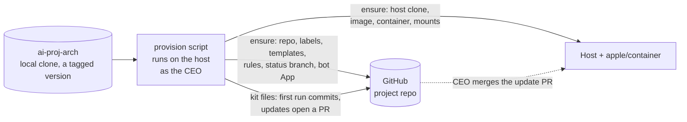

# Brainstorm: Provisioning a project

Oct 5, 2026 · CEO + PM · Status: Open

How a project gets set up, and how it picks up new versions of the kit's skills, commands and scripts. Context: the [product brief](../product-brief.md).

**How to use this doc:** each question has my recommendation. Write your answer under **CEO:**, or leave it blank to accept my recommendation.

## What's decided

**CEO:** We need a way to provision a project: an idempotent script that can be re-run to update the project repo with any new skills, commands and scripts this project offers.

**Idempotent** here means every run checks each item first and changes only what's missing or out of date. Running it twice in a row makes no changes the second time. The same command sets up a new project and updates an existing one.

## Proposed shape

## Questions

### P1. Where does provisioning run, and with whose credentials?

Setting branch protection, rulesets and labels needs **admin** rights on the repo. The bot must never have admin, or an agent could switch off the gates.

**PM recommendation:** It runs on the host with your own `gh` login. Agents in the container can't run it and don't hold credentials that could.

**CEO:**

### P2. What does it ensure?

**PM recommendation:** These items, each checked before acting. `--dry-run` prints what would change.

**On GitHub**
- [ ] The repo exists (it creates one if not)
- [ ] Labels for the story states
- [ ] Issue templates (Roadmap, Epic, Story) and the PR template
- [ ] A ruleset on `main`: required checks (`review/qa`, `review/eng`, `review/ux`, CI), and only you can merge
- [ ] A `status` branch with a starter `STATUS.md`
- [ ] The bot GitHub App is installed on this repo. If it isn't, the script prints the install link. Installing an App on a personal account can't be scripted, so this step is checked, not done

**In the repo (the kit files)**
- [ ] Role skills, slash commands, the work-loop script and the gate Actions
- [ ] The agent instructions file (see P5)

**On the host**
- [ ] A clone of the repo for the `main` mount
- [ ] The container image, built or pulled at the kit's version
- [ ] The project's container, with the `main` checkout bind-mounted

**CEO:**

### P3. How do kit files get into the project repo?

| Option | Trade-off |
| --- | --- |
| **A. Copied into the repo with a manifest; updates arrive as a PR** (recommended) | The repo stands alone, which suits single-project users. Agents see exactly the version in use. Updates go through the same gates and your merge as any other change |
| B. A git submodule pointing at ai-proj-arch | Easy to update, but submodules are awkward, and the skills would have to sit at fixed paths that both harnesses read |
| C. Installed into the container at start, never committed | Repo stays clean, but the repo no longer describes how it's built, and what runs depends on the container |

**PM recommendation:** A. The very first run on an empty repo commits straight to `main`, before the ruleset is switched on. Every later update opens a PR titled "Update ai-proj-arch kit to vX.Y.Z", which you merge.

**CEO:**

### P4. What if a project has edited a kit file?

**PM recommendation:** The manifest (`.ai-proj-arch/manifest.json`) records the kit version and a checksum for each file the kit owns. On update:

| File state | What happens |
| --- | --- |
| Unchanged since the kit wrote it | Replaced with the new version |
| Edited in the project | Left alone and listed in the PR. Nothing is overwritten silently |
| Removed from the kit | Deleted if unchanged, otherwise flagged |
| Not owned by the kit | Never touched |

Project-specific settings go in files the kit never owns, such as `.ai-proj-arch/project.toml` (which harness each role uses, the review round cap, whether UX review is on). Edits to a kit file are the exception, not the way to customize.

**CEO:**

### P5. How does one set of skills work on both harnesses?

I checked the Codex source: it loads repo skills from `.agents/skills/<name>/SKILL.md` and reads `AGENTS.md`. Claude Code loads skills from `.claude/skills/<name>/SKILL.md` and reads `CLAUDE.md`.

**PM recommendation:**
- Write the skills once, in `.agents/skills/`. Make `.claude/skills` a symlink to it
- Put the kit's instructions in a marked block inside `AGENTS.md`, so the project can add its own text outside the block
- Make `CLAUDE.md` a single line that imports `AGENTS.md` (`@AGENTS.md`)

The portability spike confirms that Claude Code follows the symlink.

**CEO:**

### P6. What language is the script written in?

| Option | Trade-off |
| --- | --- |
| Bash, plus `gh`, `git` and `jq` | Nothing to install for a GitHub-centric developer, but a manifest with checksums, dry runs and a JSON API turns hard to read and test quickly |
| **Python 3, standard library only** (recommended) | Readable, easy to unit test, no packages to install. Needs `python3` on the host, which comes with the macOS developer tools |
| A compiled Go binary | One file and fast, but a build and release pipeline before v1 |

**PM recommendation:** Python 3 with the standard library only. It calls `gh`, `git` and `container` as subprocesses. In this repo, Python is pinned with mise for development and tests.

**CEO:**

### P7. How are kit versions chosen?

**PM recommendation:** ai-proj-arch is released with semver tags. Provisioning runs from a local clone of ai-proj-arch at a tag, and writes that version into the project's manifest. It never runs as `curl … | sh`. Updating a project means checking out a newer tag and re-running the script.

**CEO:**

### P8. Does provisioning also start the container?

**PM recommendation:** No. Provisioning makes sure the image and container exist. The kit adds two small helper commands for daily use: `start`, which starts the container, and `shell`, which opens a shell and attaches to the PM's tmux session. You can still use `container exec` directly. The helpers just save typing.

**CEO:**

## Scope note

`apple/container` comes first. Everything here that touches the container goes behind the same small interface, so LXC can be added later without changing the rest.
