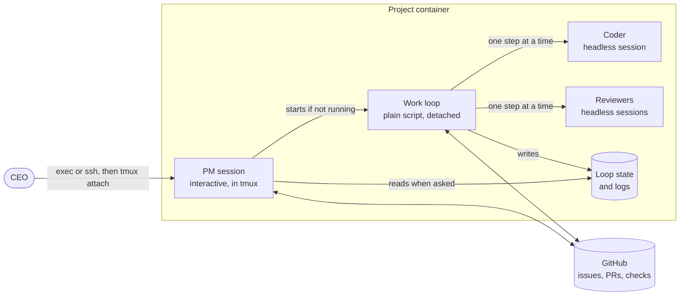

# Brainstorm: v1 session model

Oct 5, 2026 · CEO + PM · Status: Mostly decided (S1 open)

How a single project runs in v1: the CEO talks to the PM in one session, while other agents keep working in the background. Context: the [product brief](../product-brief.md).

**How to use this doc:** each question has my recommendation. Write your answer under **CEO:**, or leave it blank to accept my recommendation.

## What's decided

The CEO starts the project's container, opens a shell in it with exec or ssh, starts Claude Code or Codex, and talks to the PM. When the PM wakes, it starts other agents to do the "just keep working" part. The main session stays free for the CEO: brainstorming, status, or anything else.

## Proposed shape

## Questions

### S1. What runs the "keep working" part?

| Option | How it works | Trade-off |
| --- | --- | --- |
| **A. A plain script (the work loop)** (recommended) | A deterministic script: take the next story whose verification plan is approved, run the Coder, run the reviewers, repeat until checks pass or the round cap is hit, then mark the PR ready for the CEO | Fits the original "maybe just a script" idea. The loop's behavior is predictable and testable, and it costs no tokens to decide what's next. The judgment calls stay with the agents |
| B. A background PM agent | A second, headless PM session that decides what to run next | More flexible, but now two PMs can disagree, and every step of the loop costs tokens |
| C. The harness's own background tasks | The interactive PM uses Claude Code background tasks or the Codex equivalent | Least code, but this is exactly where the two harnesses differ most. It also ties the loop's lifetime to the PM's chat session |

**PM recommendation:** A. The PM (an LLM) decides *what* is ready: priorities, plan approval, verification plans. The script handles *how* it runs: the mechanics.

**CEO:** A, or use the Pi Durable harness?

#### S1a. Should the work loop use Pi Durable?

[Pi Durable](https://earendil.com/posts/pi-durable/) is an experimental framework released alongside Pi 1.0 for long-running agents. Every step of a run is checkpointed to SQLite or JSONL, so a new process can pick up a conversation after a crash. One harness runs many conversations, and any conversation can be forked. It runs on Node, locally or on [Cloudflare Durable Objects](https://developers.cloudflare.com/agents/harnesses/pi/).

| | Plain script (S1 A) | Pi Durable |
| --- | --- | --- |
| Agents in background steps | Claude Code or Codex, headless | Pi Durable's own agent loop, calling models through `pi-ai` |
| Same skills as the PM session | Yes | Needs its own extension for our skills. A third harness to keep in sync |
| Recovering from a crash | Resumes at the **step** level: the loop reads GitHub on start and re-runs at most the interrupted step | Resumes **inside** a step, from the last checkpoint |
| Maturity | Ours to build, small | "Experimental, and the API might still change" |
| Adds to the container | Nothing | Node and npm packages |
| Subagents | From the harness | "No built-in subagent support" |

**PM recommendation:** Start with the plain script. Because all state is on GitHub, the loop is already restartable at step boundaries, so Pi Durable's main benefit, resuming inside a step, buys little while steps are short. It would also turn the background agents into a third harness, which works against portability. Build the loop so each step goes through a small **runner** interface (Claude Code, Codex, later maybe Pi Durable). Revisit Pi Durable if steps get long enough that losing one hurts, or for the control plane, where durable orchestration across many projects is a better fit.

**CEO:**

### S2. How does the work loop start the Coder and reviewers?

Both harnesses have a headless mode that takes a prompt, works, and exits: `claude -p` for Claude Code and `codex exec` for Codex. Each step becomes one headless run with a role skill and a story, for example "Coder, story #12".

**PM recommendation:** Use headless runs, one process per step. Which harness each role uses is a setting in the project (default: the same harness the PM uses). This is the main thing the portability test checks.

**CEO:** As recommended. ✅

### S3. One story at a time, or several in parallel?

**PM recommendation:** One at a time in v1. Parallel stories bring merge conflicts, competing reviews and more tokens spent at once. Worktrees already make parallel work possible later, so nothing is lost by waiting.

**CEO:** Serial for now. ✅

### S4. What happens when the CEO closes the terminal?

**PM recommendation:**

- The PM session runs inside **tmux** in the container. You can detach, close the terminal, and later reattach from exec or ssh to pick up the same conversation.
- The work loop is a **separate, detached process**. It keeps going whether or not the PM session is open.
- When there are no ready stories left, the loop exits on its own. In v1 you stop the container yourself.

**CEO:** Not sure about the mechanism, but work must continue after the terminal closes. ✅ (requirement)

**What this means:** surviving a closed terminal is a hard requirement. tmux plus a detached loop is the starting design. The container must also stay running with nobody attached, so its main process is a long-lived init, not the CEO's shell. The portability spike checks this on `apple/container` first.

### S5. How does the PM know what the work loop is doing?

**PM recommendation:**

- The loop writes its current step and a log per run to a state folder in the container. All durable results go to GitHub: PR comments, check runs, labels.
- When you ask the PM for status, it reads the loop state, GitHub and `STATUS.md`, then answers.
- When the loop hits something it can't handle (review cap reached, a story blocked), it records a blocker in `STATUS.md` and on the story's issue. The PM raises it the next time you talk. The PM doesn't interrupt you in v1.

**CEO:** Yes. ✅

### S6. Where does `STATUS.md` live? (carried over from Q2a)

With no control plane, the main reader is you, on the host.

| Option | Trade-off |
| --- | --- |
| **A. Pushed to a `status` branch, with a copy in the mounted `main` checkout** (recommended) | You see it on the host right away, GitHub keeps the history, and `main` stays protected. The copy is gitignored on `main` |
| B. Only in the mounted `main` checkout, gitignored | Simplest, but there's no history and nothing on GitHub, which the control plane will need later |
| C. Committed to `main` with the bot bypassing protection | Breaks "only the CEO merges" |

**PM recommendation:** A.

**CEO:** The `status` branch; we can try that. ✅

### S7. Who updates `STATUS.md`?

**PM recommendation:** The work loop updates it after every step, since it knows what just finished and what's blocked. The PM updates "Coming up" whenever the roadmap or plans change. Each one writes only its own sections.

**CEO:** OK. ✅

## Next step after this brainstorm

A **portability spike**: on both Claude Code and Codex, check that the same role skill loads, that headless runs (`claude -p`, `codex exec`) work inside the container with the bot token, and that tmux plus exec works on `apple/container` (LXC comes later). The results decide whether S1 and S2 hold.
