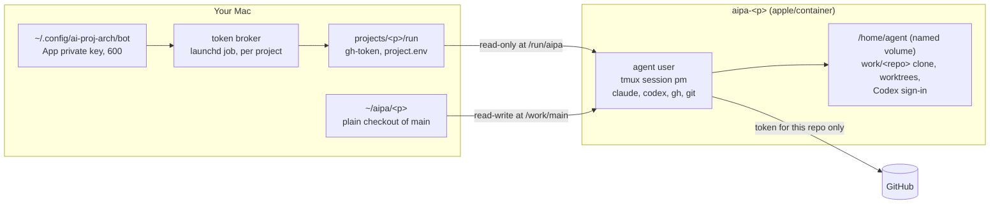

# Project containers

Each project runs in its own `apple/container` container. Agents work inside it as a non-root user. You watch the latest merged code in a plain checkout of `main` on your Mac.

This page covers the container, the `aipa` helper commands and the token broker ([#2](https://github.com/dpeckham/ai-proj-arch/issues/2)). Full provisioning ([#3](https://github.com/dpeckham/ai-proj-arch/issues/3)) builds on `aipa create`.

## Quick start

```bash
bin/aipa create yawnbooks --repo dpeckham/yawnbooks   # once per project
bin/aipa shell yawnbooks                              # starts everything, opens the PM's tmux session
```

Inside the session you're in the agent's clone of the repo. `claude` and `codex` are ready to use. Detach with `Ctrl-b d`, or just close the terminal: the session and anything running in it keep going. Run `aipa shell` again to reattach.

| Command | What it does |
| --- | --- |
| `aipa build-image [--no-cache]` | Builds `ai-proj-arch/agent:<version>` from `container/Containerfile` |
| `aipa create <project> --repo <owner>/<name> [--main-dir <dir>]` | Writes the project config, clones `main` on the host (default `~/aipa/<project>`), and creates the home volume and the container. Safe to re-run |
| `aipa start <project>` | Starts the container and the token broker, then sets up the agent's clone and identity |
| `aipa shell <project>` | Runs `start` if needed, then attaches to tmux session `pm` |
| `aipa stop <project>` | Stops the container and the broker, and deletes the current token |
| `aipa status <project>` | Shows the container, broker and token state |

Inside the container, reviewer roles post their verdicts with `aipa-review-check` (see [gates.md](gates.md)).

## Before the first run

- **`apple/container` installed and running:** `container system start --enable-kernel-install`. The first start installs a default kernel and fails if nothing can answer its prompt
- **The bot App:** `~/.config/ai-proj-arch/bot/config.json` and `private-key.pem`, folder 700 and files 600. The App is named `<github-username>-bot` and installed on the project's repo. It needs Contents, Pull requests, Issues and Checks as read/write, and **no** Workflows or Administration access
- **Claude Code credentials:** `~/.config/ai-proj-arch/harness.env` (600), with one line `CLAUDE_CODE_OAUTH_TOKEN=…` from `claude setup-token`. To create it without the token reaching your shell history:

  ```bash
  read -rs T && printf 'CLAUDE_CODE_OAUTH_TOKEN=%s\n' "$T" > ~/.config/ai-proj-arch/harness.env && chmod 600 ~/.config/ai-proj-arch/harness.env && unset T
  ```

- **Codex credentials:** sign in once per project, inside the container:

  ```bash
  container exec -it --user agent --env HOME=/home/agent aipa-<project> codex login --device-auth
  ```

  The sign-in is stored in the home volume, so it survives restarts and image upgrades.

Host tools: `bash`, `git`, `gh` (logged in as you), `jq`, `openssl` and `curl`. All ship with current macOS apart from `gh`.

## What runs where



| In the container | Comes from | Notes |
| --- | --- | --- |
| `/run/aipa` (read-only) | `~/.config/ai-proj-arch/projects/<p>/run` | `gh-token` (rotated by the broker) and `project.env` (repo name, not secret) |
| `/work/main` | `~/aipa/<p>` | Only `aipa-sync-main` writes here, and only by fast-forward. Never create worktrees from it ([spike C5](spikes/2026-10-portability.md)) |
| `/home/agent` | Named volume `aipa-<p>-home` | The agent's own clone at `work/<repo>`, worktrees, tool sign-ins. It survives recreating the container |

Inside the container:
- **`gh` and `git`** act as the bot, through a `gh` wrapper and a git credential helper. Both read `/run/aipa/gh-token` on every call, so a rotated token takes effect immediately
- **`aipa-sync-main`** fast-forwards `/work/main` from GitHub. It refuses if the checkout has local changes, is on another branch, or has diverged

## Security model

- **The App private key never enters a container.** The broker mints tokens on the host
- **Tokens are scoped to one repository** (`DNBG_REVIEWER_REPOSITORIES` in the vendored `mint-token.sh`) and expire after an hour. A token for one project gets `403` on another project's repo, even within the same installation
- **Agents can't change workflows.** The bot has no Workflows permission, so GitHub rejects any push that touches `.github/workflows/`. That's what keeps the gate Actions out of the agents' reach. Workflow changes are made by you, or by provisioning running as you
- **The container is the boundary.** Inside it, Claude Code and Codex run with full access, because Codex's own sandbox doesn't work inside `apple/container` and Claude's tool allow-list isn't a hard limit ([spike S4, H1](spikes/2026-10-portability.md)). The container holds one repo and a short-lived token for it, and nothing else of yours
- **Credentials on disk are checked.** `aipa` refuses a key or credentials file that others can read or write
- **Image downloads are pinned and verified.** Every download in the image build is pinned in `container/versions.env` and checked against its SHA-256. A mismatch fails the build

## Updating tool versions

Edit `container/versions.env`. Change a version together with both of its checksums, then run `aipa build-image`. Recreating a project's container (`container delete aipa-<p>`, then `aipa create <p>`) keeps the home volume. Provisioning will do this as part of a kit update.

## Checking a project end to end

```bash
tests/integration/e2e.sh <project> [--push] [--harness]
```

This runs 11 checks against the real container: user, tools, token presence and scope, the read-only mount, bot identity, clone, main sync and tmux. `--push` adds a throwaway branch push, the workflow-rejection check and cleanup. `--harness` adds one tiny prompt each to Claude Code and Codex.

Unit tests (no container needed): `mise exec -- bats tests/`. Lint: `mise exec -- shellcheck bin/aipa lib/aipa/*.sh container/rootfs/usr/local/bin/* tests/integration/e2e.sh`.

## Troubleshooting

| Symptom | Fix |
| --- | --- |
| `gh: no bot token at /run/aipa/gh-token` | The broker isn't running. Run `aipa status <p>` and read `~/Library/Logs/ai-proj-arch/<p>-broker.log`. `aipa start <p>` reloads it |
| The broker log says "The reviewer App is missing a permission" | Grant the listed permission in the App settings, then accept it on the installation |
| `tmux` shows a client still "(attached)" after you closed a terminal | Harmless. The next `aipa shell` detaches it (`tmux new-session -A -D`) |
| `aipa-sync-main` refuses to update | Someone changed `~/aipa/<p>` by hand. Commit, stash or discard those changes on the host |
