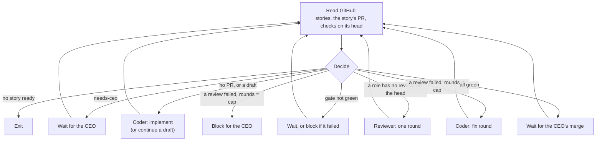

# The work loop

`aipa-loop` moves stories from `state:verification-ready` to "ready for the CEO to merge", one story at a time, by running the Coder and the reviewers as headless agent runs ([#6](https://github.com/dpeckham/ai-proj-arch/issues/6)). It's a plain Bash script in the container image. Agents decide *what* is right; the loop only handles *what runs next*.

## Running it

| Where | Command |
| --- | --- |
| In the container (the PM does this on waking) | `aipa-loop start`, `aipa-loop status`, `aipa-loop stop` |
| From the host | `bin/aipa loop <project> [start\|status\|stop\|step]` |

`start` runs it in the background, so it survives the PM session and the terminal closing. It's safe to call when the loop is already running. `step` takes one action and exits, which is useful for debugging. Logs and every run's prompt, log and report are in `~/.aipa/loop/` in the container.

## What it does each pass



- **One story at a time.** It works on the story already in flight (`state:in-progress` or `state:in-review`). Otherwise it takes the first `state:verification-ready` story in Roadmap, then Epic, checklist order. It doesn't start the next story until you've merged the current one.
- **Restartable.** Every decision comes from GitHub: labels, the open PR that closes the story, and the check runs on its head commit. After a crash or a container restart it re-runs at most one step. The fix-round count is the number of PR commits with a failed `review/*` check.
- **It never trusts an exit code.** After each run it checks GitHub: is there a ready PR, was `review/<role>` posted on the head, did the Coder push a new commit. If not, it retries a reviewer once, then blocks.
- **Reviews are per commit.** A push leaves the new head with no `review/*` checks, so every role reviews again, looking at what changed since its last review.
- **Story states.** It moves the story to `state:in-progress` when the Coder starts and `state:in-review` once the PR is ready.
- **Status.** It records finished stories in `STATUS.md` ("Recently finished") once their PR merges.
- **Blockers.** It comments `**[LOOP]** Blocked: …` on the story, with the last agent report, adds `needs-ceo`, and lists it under "Blockers" in `STATUS.md`. Removing the label lets the loop pick the story up again.
- **Waiting costs nothing.** While it waits it polls GitHub every 2 minutes, with no agent runs, and exits after 12 hours with nothing to do.
- **The clone stays current.** The agents' clone (`~/work/<repo>`) is fast-forwarded to the latest `main` on every pass, so agents always load the current kit. A clone with uncommitted changes is left alone.

## Settings

In the project's `.ai-proj-arch/project.toml`. It's read from `main`, so changes apply once merged:

```toml
[harness]           # "claude" or "codex" for each role
coder = "codex"
qa = "claude"
eng = "codex"
ux = "claude"

[loop]
review_rounds = 2   # fix rounds before a story is blocked for the CEO
```

Environment overrides: `AIPA_LOOP_POLL` (seconds, default 120), `AIPA_LOOP_MAX_WAIT` (default 43200), and `AIPA_LOOP_RUN_TIMEOUT` (per agent run, default 3600).

## Verified on `dpeckham/aipa-sandbox` (Oct 6, 2026)

| Step | Harness | Result |
| --- | --- | --- |
| Story #11's PR #14, all green | — | `wait-merge`. After the CEO merged, the loop recorded #11 as finished |
| Story #12, implement | Codex | PR #17 opened and marked ready. The loop moved #12 to `state:in-review` |
| Reviews on the first head | Claude Code (qa, ux), Codex (eng) | All three posted `success` |
| Container rebuilt and loop restarted | — | Recovered the same `wait-merge` state from GitHub alone |
| A planted `review/ux` finding (inline, README) | — | Decided `fix` (round 1 of 2) |
| Fix round | Codex | Pushed `ad3b461`, replied in the thread as `**[CODER]**` and left it open for the reviewer |
| Re-review of the new head | Claude Code (qa, ux), Codex (eng) | All three posted `success`. The UX reviewer resolved its own thread (0 open), and the loop went back to `wait-merge`, with 1 of 2 rounds used |

Found and fixed during the runs:
- **Lost log lines:** `run_agent` logs were captured into the report path, so the loop now logs to stderr.
- **Stale clone:** the agents' clone stayed on an old `main`, so agents didn't see a newly shipped script. It's now fast-forwarded on every pass, and a clean detached clone is switched back to `main` first.
- **Runs outliving the timeout:** a Codex run outlived the 60-minute timeout, because TERM alone doesn't stop it. Runs now get KILL 60 seconds later.
- **Skill filter:** the review skill's thread filter choked on `pr-threads.sh`'s status line. It now keeps only the JSON lines.

Unit tests: `tests/loop.bats` covers the decision table, config parsing, story order and selection, run logging, and clone syncing.
