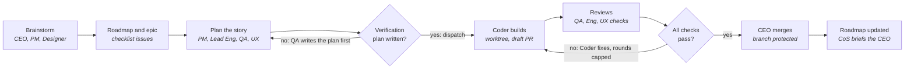
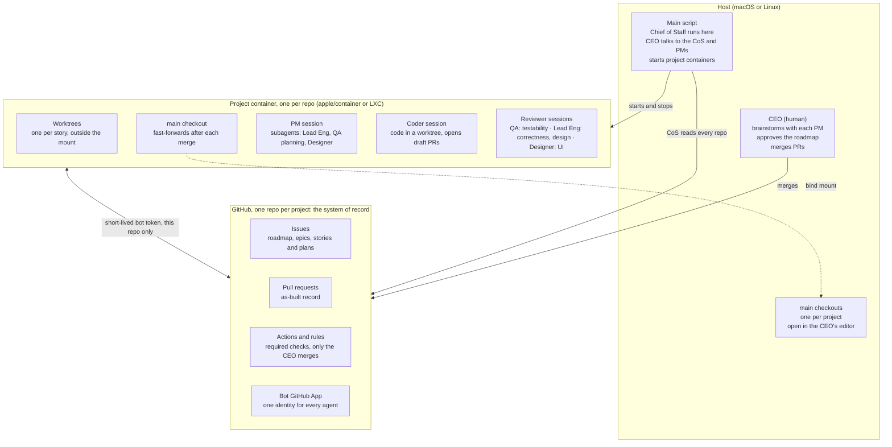

# Product Brief: ai-proj-arch

Oct 5, 2026 · Dave Peckham · Status: Draft

## Summary

A solo founder runs each AI-first project like a small company: they talk to a **Chief of Staff** and a **PM per project**, and a team of specialist agents plans, builds, tests and reviews the work autonomously through GitHub. The founder acts as **CEO**: they set direction, approve the roadmap and merge. Story plans are approved by the PM, not the CEO.

The suite is a set of portable agent definitions (skills, slash commands, tools) plus one host script. It runs on Claude Code and Codex, stores all state in GitHub, and isolates each project in its own container.

## Problem

Vibe coding doesn't scale past a prototype, and the existing alternatives are either too heavy or tied to one harness.

| Today's option | What works | Why it falls short |
| --- | --- | --- |
| Vibe coding (one human, one agent) | Fast to start | No plan, no verification plan, no record of decisions; quality degrades as the codebase grows |
| [Paperclip](https://github.com/paperclipai/paperclip) | Org chart, roles, goal alignment, approval gates, any harness | Node server, React UI, budgets, heartbeats, multi-org: built for 24/7 autonomous companies, too heavy for one founder |
| [Dan Baggott's claude-plugins](https://github.com/dbaggott/claude-plugins) | Worktree to draft PR flow, cold-handoff issues, independent bot reviewer, proven over 1,200+ PRs | Claude Code plugins and hooks only; does not run on Codex |

GitHub already provides most of the system we need: issues for plans and roadmap, PRs for review, Actions and branch protection for gates, and GitHub Apps for agent identity.

## Users and roles

There is one human user, the solopreneur in the **CEO** role. Every other role is an agent. The CEO talks mainly to the Chief of Staff and to each project's PM.

| Role | Where it runs | Owns | Reviews | Talks to |
| --- | --- | --- | --- | --- |
| CEO (human) | Host | Direction, roadmap approval, merging (not story plans) | Anything it chooses | CoS, PMs |
| Chief of Staff | Host, inside the main script | Cross-project status, priorities, what needs the CEO | Nothing; reads all project repos | CEO, every PM |
| PM | Project container | Roadmap issue, epics, feature design; approves story plans and decides when work starts | Plans against the roadmap | CEO, Lead Eng, QA, Designer, Coder |
| Lead Engineer | Project container (consultant) | Technical approach in plans | PRs for design and correctness | PM, Coder |
| QA Lead | Project container | Verification plan before work starts; tests | PRs for testability | PM, Coder |
| UX/UI Designer | Project container (consultant); skipped only for projects with no UI, which is rare | Consistent look and feel, usability | PRs that change the UI | PM (ideation), Coder |
| Coder | Project container | Code and bug fixes | Nothing | PM, reviewers |

The Lead Engineer and QA Lead both review PRs, but they look at different things: correctness and design versus testability.

## Principles

1. **Portable by default.** Roles are defined as Agent Skills, slash commands and CLI tools that run unchanged on Claude Code and Codex. Anything specific to one harness is an optional adapter, never the source of truth.
2. **A script, not a platform.** Orchestration is one host script. There is no server, database or dashboard.
3. **GitHub is the system of record.** The roadmap is an issue with a checklist, and so is each epic. Plans, verification plans, decisions and as-built records live in issues and PRs. We don't use GitHub Projects.
4. **Gates live in GitHub, not in prompts.** Labels, required checks, branch protection and Actions enforce the process. That way every harness follows the same rules.
5. **No verification plan, no start.** The PM doesn't dispatch work until the QA Lead has written how it will be verified.
6. **One project, one repo, one container.** The container is `apple/container` on macOS or LXC on Linux, behind one interface; both are supported. The container isolates the agents. The host keeps a live, read-only view of `main`.
7. **Every agent acts as the bot.** All agents act through one GitHub App, so their reviews are independent of the CEO's account. Only the CEO merges.
8. **Autonomous between decisions.** Agents run unattended and stop only for decisions that belong to the CEO.

## Core loop and gates

The CEO steps in twice: to shape the roadmap and to merge. Everything in between runs autonomously behind two gates.

The first gate stops planning from turning into code until QA has defined how the work will be verified. The second gate loops the Coder through review rounds, up to a cap, until every reviewer's check passes.

## Architecture

Three layers: the host runs the script and the Chief of Staff; each project runs in its own container; GitHub holds all shared state.

Projects never talk to each other directly. Agents in a container hold a token for their own repo and nothing else.

**Not designed yet:** how the CEO, the Chief of Staff and the PMs talk to each other. The diagram shows the CoS reading GitHub, but the daily report (below) needs the CoS to check in with each PM. See the open questions.

## v1 scope

v1 is done when one real project goes from a roadmap item to a merged PR with no human input other than the brainstorm and the merge, on both Claude Code and Codex.

**Host script**

- [ ] Create a project: repo, container, bot App installation, labels, issue templates, `main` mount
- [ ] Start and stop a project's container and its agent sessions, using `apple/container` on macOS and LXC on Linux behind one interface
- [ ] Open a conversation with the Chief of Staff, or with a project's PM

**Project container**

- [ ] One image with Claude Code, Codex, `git` and `gh`, with the harness chosen per role
- [ ] Agents work only in worktrees. The `main` checkout is bind-mounted to the host and fast-forwards after each merge
- [ ] A short-lived installation token for the bot, scoped to that one repo

**Role definitions (portable skills)**

- [ ] Chief of Staff, PM, Lead Engineer, QA Lead, UX/UI Designer, Coder
- [ ] Issue formats: Roadmap (checklist of epics), Epic (checklist of stories), Story (spec, plan, **Verification plan**, acceptance criteria)
- [ ] PR format: the as-built record, linking its story

**Gates in GitHub**

- [ ] Status labels that move a story from idea to plan, then to verification plan ready, in progress and in review
- [ ] An Action that blocks a PR whose story has no verification plan
- [ ] Required checks per reviewer role (`review/qa`, `review/eng`, `review/ux` when UI changed), plus CI
- [ ] Branch protection: only the CEO can merge

**Autonomous loop**

- [ ] The PM plans with its consultants, gets the verification plan, dispatches the Coder, runs review rounds until all checks pass, then hands the merge to the CEO
- [ ] **Daily report:** the Chief of Staff checks in with each project's PM and gives the CEO one report: what shipped, what's ready to merge, what's blocked, and which decisions are waiting. This replaces the daily report Paperclip produces today

## Non-goals for v1

- A web UI, dashboard or mobile app
- GitHub Projects, or any tracker besides issues
- Budgets, cost dashboards or spend limits (only a cap on review rounds)
- Always-on heartbeats or agents running 24/7 (one scheduled daily report is in scope)
- Multiple users, multiple organizations or RBAC
- Agents merging PRs or deploying to production
- Forges other than GitHub
- Business roles beyond product engineering (marketing, sales, finance)

## Success metrics

| Metric | Target | Why it matters |
| --- | --- | --- |
| Merged stories that had a verification plan before work started | 100% | The core quality gate is actually enforced |
| CEO actions per merged PR besides the merge | 0 typical, at most 1 | The team is really autonomous |
| Review rounds before all checks pass | Tracked, with a hard cap | Shows whether plans and specs are good enough |
| Bugs filed against a story within 14 days of merge | Tracked per project | Escaped defects show whether verification works |
| v1 flow passes on Claude Code and on Codex | Both | Portability is real, not aspirational |
| Commands to create a new project | 1 | Low overhead, unlike Paperclip |

## Risks and open questions

| Risk | Impact | Mitigation |
| --- | --- | --- |
| Skills, subagents and background waiting don't behave the same on Claude Code and Codex | Portability breaks, which is the core promise | Run a spike on both harnesses before building roles. Keep anything specific to one harness in thin adapters |
| One bot identity can't count as several approvals in branch protection | QA, Eng and UX reviews collapse into one | Each reviewer role posts its own required check run, not a PR approval |
| Git worktree metadata stores absolute paths | The `main` mount looks broken on the host | Keep worktrees outside the mounted path. The mount holds only a plain `main` checkout |
| Agents with write tokens read untrusted text (issues, web pages, dependencies) | Prompt injection pushes malicious code or leaks secrets | Use a short-lived token scoped to one repo, no secrets in the container beyond that, and only the CEO merges |
| Two container runtimes (`apple/container`, LXC) | Double the setup and test surface; behavior drifts between macOS and Linux | Keep the runtime interface small (create, start, stop, exec, mount), and run the v1 flow on both |
| Autonomous review loops run without stopping | Wasted tokens, churn | Cap review rounds. Hitting the cap escalates to the PM, then the CEO |

**Open questions**

- [ ] **Communication channel.** How do the CEO, the Chief of Staff and the PMs talk to each other? This drives the design of the host script. Brainstorm in progress: [communication channel](brainstorms/2026-10-05-communication-channel.md). Sub-questions:
    - How does the CoS reach a PM inside its container: start a session in the container, comment on a GitHub issue, or read a status file the PM writes?
    - What triggers the daily report, and where does it land (terminal, a Markdown file, a notification)?
    - How does the CEO answer a question raised in the report and route it back to the right PM?
    - Does the CoS keep its own cross-project notes, for example in an HQ repo?

## Decision log

| Date | Decision | By |
| --- | --- | --- |
| 2026-10-05 | No GitHub Projects. The roadmap is an issue with a checklist, and so is each epic | CEO |
| 2026-10-05 | The Chief of Staff runs on the host, inside the main script | CEO |
| 2026-10-05 | Only the CEO merges in v1 | CEO |
| 2026-10-05 | All agents act through one GitHub App bot identity | CEO |
| 2026-10-05 | Gates are enforced in GitHub, not in harness hooks | CEO, on PM recommendation |
| 2026-10-05 | Consultants (Lead Eng, QA planning, Designer) run as subagents. Coder and reviewers run as separate sessions | CEO, on PM recommendation |
| 2026-10-05 | Lead Engineer review (correctness, design) is separate from QA review (testability) | CEO |
| 2026-10-05 | Agents run autonomously between CEO decisions | CEO |
| 2026-10-05 | The CEO approves the roadmap and merges. The PM approves story plans | CEO |
| 2026-10-05 | v1 supports both `apple/container` and LXC | CEO |
| 2026-10-05 | The UX/UI Designer is on by default, skipped only for projects with no UI | CEO |
| 2026-10-05 | A daily report from the Chief of Staff, gathered from each PM, is in v1 scope | CEO |
| 2026-10-05 | The product is named ai-proj-arch | CEO |
