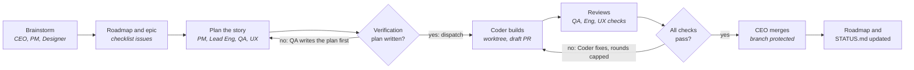
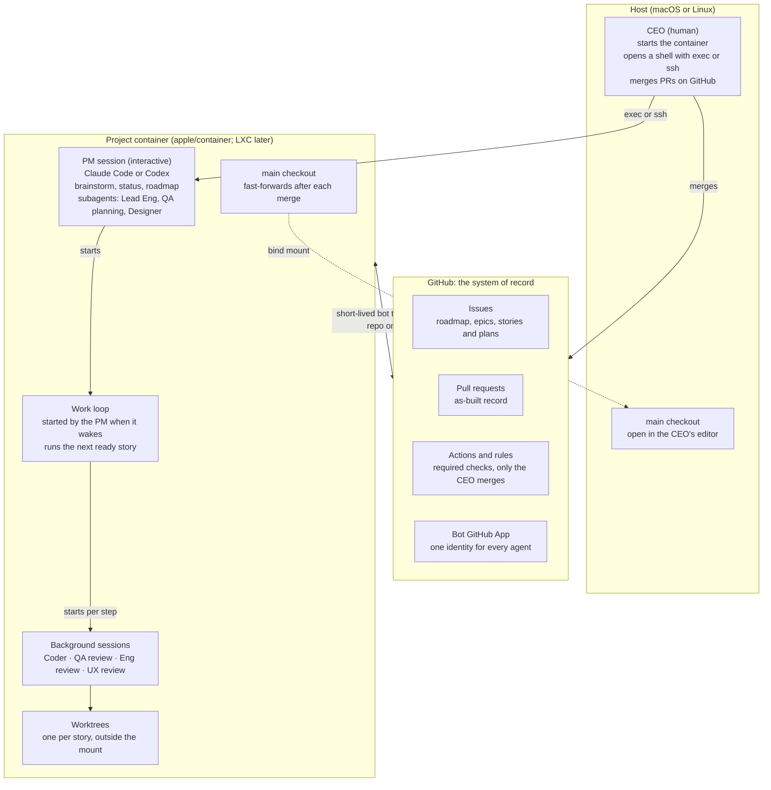

# Product Brief: ai-proj-arch

Oct 5, 2026 · Dave Peckham · Status: Draft

## Summary

A solo founder runs each AI-first project like a small company: they talk to a **PM** for the project, and a team of specialist agents plans, builds, tests and reviews the work autonomously through GitHub. The founder acts as **CEO**: they set direction, approve the roadmap and merge. Story plans are approved by the PM, not the CEO.

The suite is a **project kit**: portable agent definitions (skills, slash commands, tools), a small work-loop script and a container image. It runs on Claude Code and Codex, stores all state in GitHub, and isolates each project in its own container.

**v1 is one project.** The CEO starts the project's container, opens a shell in it, starts Claude Code or Codex, and talks to the PM. A **control plane** for several projects (a Chief of Staff, daily reports, container lifecycle) comes after v1.

## Problem

Vibe coding doesn't scale past a prototype, and the existing alternatives are either too heavy or tied to one harness.

| Today's option | What works | Why it falls short |
| --- | --- | --- |
| Vibe coding (one human, one agent) | Fast to start | No plan, no verification plan, no record of decisions; quality degrades as the codebase grows |
| [Paperclip](https://github.com/paperclipai/paperclip) | Org chart, roles, goal alignment, approval gates, any harness | Node server, React UI, budgets, heartbeats, multi-org: built for 24/7 autonomous companies, too heavy for one founder |
| [Dan Baggott's claude-plugins](https://github.com/dbaggott/claude-plugins) | Worktree to draft PR flow, cold-handoff issues, independent bot reviewer, proven over 1,200+ PRs | Claude Code plugins and hooks only; does not run on Codex |

GitHub already provides most of the system we need: issues for plans and roadmap, PRs for review, Actions and branch protection for gates, and GitHub Apps for agent identity.

## Users and roles

There is one human user, the solopreneur in the **CEO** role. Every other role is an agent. In v1 the CEO talks only to the PM.

| Role | In v1? | Where it runs | Owns | Reviews | Talks to |
| --- | --- | --- | --- | --- | --- |
| CEO (human) | Yes | Host, plus a shell into the container | Direction, roadmap approval, merging (not story plans) | Anything it chooses | PM |
| PM | Yes | Project container, interactive session | Roadmap issue, epics, feature design; approves story plans and decides when work starts; starts the work loop | Plans against the roadmap | CEO, Lead Eng, QA, Designer, Coder |
| Lead Engineer | Yes | Project container (consultant) | Technical approach in plans | PRs for design and correctness | PM, Coder |
| QA Lead | Yes | Project container | Verification plan before work starts; tests | PRs for testability | PM, Coder |
| UX/UI Designer | Yes; skipped only for projects with no UI, which is rare | Project container (consultant) | Consistent look and feel, usability | PRs that change the UI | PM (ideation), Coder |
| Coder | Yes | Project container, background session | Code and bug fixes | Nothing | PM, reviewers |
| Chief of Staff | After v1 | Host, in the control plane | Cross-project status, priorities, daily report | Nothing | CEO, every PM |

The Lead Engineer and QA Lead both review PRs, but they look at different things: correctness and design versus testability.

## Principles

1. **Portable by default.** Roles are defined as Agent Skills, slash commands and CLI tools that run unchanged on Claude Code and Codex. Anything specific to one harness is an optional adapter, never the source of truth.
2. **A script, not a platform.** The only orchestration is a small work-loop script inside the container. There is no server, database or dashboard.
3. **GitHub is the system of record.** The roadmap is an issue with a checklist, and so is each epic. Plans, verification plans, decisions and as-built records live in issues and PRs. We don't use GitHub Projects.
4. **Gates live in GitHub, not in prompts.** Labels, required checks, branch protection and Actions enforce the process. That way every harness follows the same rules.
5. **No verification plan, no start.** The PM doesn't dispatch work until the QA Lead has written how it will be verified.
6. **One project, one repo, one container.** The container is `apple/container` on macOS first, then LXC on Linux, behind one small interface. The container isolates the agents. The host keeps a live, read-only view of `main`.
7. **Every agent acts as the bot.** All agents act through one GitHub App, so their reviews are independent of the CEO's account. Only the CEO merges.
8. **Autonomous between decisions.** Agents run unattended and stop only for decisions that belong to the CEO.
9. **The project kit stands alone.** Everything a single project needs lives in the project. The control plane, when it comes, only adds a layer on top.
10. **Reuse Dan's work wherever it fits.** The skills, scripts and reviewer-bot setup from [dbaggott/claude-plugins](https://github.com/dbaggott/claude-plugins) are the starting point. We vendor them at a pinned upstream commit, keep our changes small and marked, and offer portability fixes back upstream.

## Core loop and gates

The CEO steps in twice: to shape the roadmap and to merge. Everything in between runs autonomously behind two gates.

The first gate stops planning from turning into code until QA has defined how the work will be verified. The second gate loops the Coder through review rounds, up to a cap, until every reviewer's check passes.

## Architecture (v1)

The CEO works in two places: a terminal session with the PM inside the container, and an editor on the host showing `main`. All shared state lives on GitHub.

The PM's interactive session stays free for the CEO: brainstorming, status questions, roadmap changes. The "keep working" part runs in the background. How the work loop and background sessions work is being decided in the [v1 session model brainstorm](brainstorms/2026-10-05-v1-session-model.md).

## v1 scope

v1 is done when one real project goes from a roadmap item to a merged PR with no human input other than the brainstorm and the merge, on both Claude Code and Codex.

**Provisioning** (see [brainstorm](brainstorms/2026-10-05-provisioning.md))

- [ ] One idempotent script, run on the host as the CEO, that sets up a new project and updates an existing one: repo, labels, templates, ruleset, `status` branch, bot App check, kit files, host clone, image and container
- [ ] Kit updates arrive as a PR the CEO merges. If a kit file was edited in the project, the script asks what to do (keep, overwrite, diff, save beside it)
- [ ] Written in Bash with `gh` and `git`. No other host dependencies
- [ ] Every run checks for a newer kit release and asks before updating, script first, then the project
- [ ] Helper commands for daily use: `start` the container and open a `shell` attached to the PM's tmux session

**Project container**

- [ ] One image with Claude Code, Codex, `git`, `gh` and `tmux`
- [ ] Runs on `apple/container`, with `main` bind-mounted to the host. LXC comes after v1
- [ ] Keeps running with nobody attached. Closing the terminal stops neither the PM session nor the work loop
- [ ] Agents work only in worktrees. The `main` checkout fast-forwards after each merge
- [ ] A short-lived installation token for the bot, scoped to that one repo

**Role definitions (portable skills)**

- [ ] PM, Lead Engineer, QA Lead, UX/UI Designer, Coder
- [ ] Issue formats: Roadmap (checklist of epics), Epic (checklist of stories), Story (spec, plan, **Verification plan**, acceptance criteria)
- [ ] PR format: the as-built record, linking its story
- [ ] `STATUS.md`: recently finished, blockers, coming up

**Gates in GitHub**

- [ ] Status labels that move a story from idea to plan, then to verification plan ready, in progress and in review
- [ ] An Action that blocks a PR whose story has no verification plan
- [ ] Required checks per reviewer role (`review/qa`, `review/eng`, `review/ux` when UI changed), plus CI
- [ ] Branch protection: only the CEO can merge

**Autonomous loop**

- [ ] When the PM wakes, it starts the work loop in the background and stays available to the CEO
- [ ] The work loop is a plain Bash script that runs one story at a time. Each step goes through a small runner interface so other engines can be added later. Each step is a headless Claude Code or Codex run (`claude -p`, `codex exec`)
- [ ] The work loop runs the Coder and review rounds until all checks pass, then marks the PR ready for the CEO to merge
- [ ] `STATUS.md` lives on a `status` branch. The work loop updates it after each step, and the PM updates "Coming up"
- [ ] The PM answers "what's the status?" from GitHub, `STATUS.md` and the work loop's state

## Non-goals for v1

- **LXC.** v1 runs on `apple/container` only
- **The control plane:** several projects, the Chief of Staff, daily reports, starting and stopping containers automatically, an HQ repo
- A web UI, dashboard or mobile app
- GitHub Projects, or any tracker besides issues
- Budgets, cost dashboards or spend limits (only a cap on review rounds)
- Always-on heartbeats, or agents running 24/7 with no work to do
- Multiple users, multiple organizations or RBAC
- Agents merging PRs or deploying to production
- Forges other than GitHub
- Business roles beyond product engineering (marketing, sales, finance)

## Success metrics

| Metric | Target | Why it matters |
| --- | --- | --- |
| Merged stories that had a verification plan before work started | 100% | The core quality gate is actually enforced |
| CEO actions per merged PR besides the merge | 0 typical, at most 1 | The team is really autonomous |
| Review rounds before all checks pass | Tracked, with a hard cap | Shows whether plans and specs are good enough |
| Bugs filed against a story within 14 days of merge | Tracked per project | Escaped defects show whether verification works |
| v1 flow passes on Claude Code and on Codex, on `apple/container` | Both harnesses | Portability is real, not aspirational |
| Commands from an empty repo to talking with the PM | Provision once, then start and shell | Low overhead, unlike Paperclip |

## Risks and open questions

| Risk | Impact | Mitigation |
| --- | --- | --- |
| Skills, subagents and background sessions don't behave the same on Claude Code and Codex | Portability breaks, which is the core promise | Run a spike on both harnesses before building roles. Keep anything specific to one harness in thin adapters |
| One bot identity can't count as several approvals in branch protection | QA, Eng and UX reviews collapse into one | Each reviewer role posts its own required check run, not a PR approval |
| Git worktree metadata stores absolute paths | The `main` mount looks broken on the host | Keep worktrees outside the mounted path. The mount holds only a plain `main` checkout |
| Agents with write tokens read untrusted text (issues, web pages, dependencies) | Prompt injection pushes malicious code or leaks secrets | Use a short-lived token scoped to one repo, no secrets in the container beyond that, and only the CEO merges |
| Autonomous review loops run without stopping | Wasted tokens, churn | Cap review rounds. Hitting the cap escalates to the PM, then the CEO |
| GitHub only enforces rulesets and branch protection on private repos with a paid plan (Pro or Team) | On a free plan the bot can push straight to `main`, and every gate is advisory | Require GitHub Pro for private projects. Provisioning checks this first and stops if the gates can't be enforced |
| Adding LXC after v1 exposes macOS-only assumptions | Rework when LXC arrives | Keep what the kit needs from the runtime small (create, start, exec, bind mount) and behind one interface from day one |
| Provisioning overwrites a project's own changes | Lost work, distrust of updates | The manifest tracks checksums. The script asks before touching an edited kit file, and every update is a PR |

**Open questions**

- [ ] **Communication channel for the control plane:** tabled until after v1. See [the brainstorm](brainstorms/2026-10-05-communication-channel.md).

## Decision log

| Date | Decision | By |
| --- | --- | --- |
| 2026-10-05 | No GitHub Projects. The roadmap is an issue with a checklist, and so is each epic | CEO |
| 2026-10-05 | Only the CEO merges in v1 | CEO |
| 2026-10-05 | All agents act through one GitHub App bot identity | CEO |
| 2026-10-05 | Gates are enforced in GitHub, not in harness hooks | CEO, on PM recommendation |
| 2026-10-05 | Consultants (Lead Eng, QA planning, Designer) run as subagents. Coder and reviewers run as separate sessions | CEO, on PM recommendation |
| 2026-10-05 | Lead Engineer review (correctness, design) is separate from QA review (testability) | CEO |
| 2026-10-05 | Agents run autonomously between CEO decisions | CEO |
| 2026-10-05 | The CEO approves the roadmap and merges. The PM approves story plans | CEO |
| 2026-10-05 | v1 supports both `apple/container` and LXC | CEO |
| 2026-10-05 | The UX/UI Designer is on by default, skipped only for projects with no UI | CEO |
| 2026-10-05 | The product is named ai-proj-arch | CEO |
| 2026-10-05 | Two layers: a project kit that stands alone, and an optional control plane on top. The PM runs its own project | CEO |
| 2026-10-05 | Each project has a `STATUS.md`: recently finished, blockers, coming up | CEO |
| 2026-10-05 | **v1 is a single project with no control plane.** The CEO starts the container, opens a shell with exec or ssh, and talks to the PM. The PM starts background agents to keep working. Supersedes: the Chief of Staff runs on the host in v1, and the daily report is in v1 | CEO |
| 2026-10-05 | Background steps are headless Claude Code or Codex runs, one process per step. The harness for each role is a project setting | CEO |
| 2026-10-05 | The work loop runs one story at a time | CEO |
| 2026-10-05 | Work must keep going after the CEO closes the terminal | CEO |
| 2026-10-05 | The loop records blockers in `STATUS.md` and on the issue. The PM raises them the next time the CEO talks to it | CEO |
| 2026-10-05 | `STATUS.md` lives on a `status` branch. The loop updates it after each step, and the PM updates "Coming up" | CEO |
| 2026-10-05 | `apple/container` first. LXC comes after v1. Supersedes: v1 supports both | CEO |
| 2026-10-05 | v1 includes an idempotent provisioning script that sets up a project and updates it to new kit versions | CEO |
| 2026-10-05 | Provisioning runs on the host with the CEO's `gh` login. The bot never gets admin | CEO |
| 2026-10-05 | Kit files are copied into the repo with a manifest. The first run commits directly, and later updates are PRs | CEO |
| 2026-10-05 | If a kit file was edited in the project, provisioning asks the user interactively what to do | CEO |
| 2026-10-05 | Skills live in `.agents/skills/`, and `.claude/skills` is a symlink to it | CEO |
| 2026-10-05 | Provisioning is written in Bash with `gh` and `git` | CEO |
| 2026-10-05 | Kit versions are semver tags. Projects are provisioned from a local clone, never `curl \| sh` | CEO |
| 2026-10-05 | Provisioning doesn't start the container. `start` and `shell` helper commands do | CEO |
| 2026-10-05 | The work loop is a plain script with a runner interface, not Pi Durable. Revisit Pi with a Coder-runner experiment after v1, and for the control plane | CEO |
| 2026-10-05 | Relicense from MIT to Apache 2.0, to match dbaggott/claude-plugins and keep adapted files under one license. A NOTICE file credits adapted work | CEO |
| 2026-10-05 | Reuse as much of dbaggott/claude-plugins as possible: vendor at a pinned commit, keep changes small, offer portability fixes upstream | CEO |
| 2026-10-05 | Private projects require GitHub Pro (or Team) so the gates can be enforced. The CEO is upgrading. Found while testing on yawnbooks | CEO |
| 2026-10-05 | yawnbooks is the first test project for provisioning. Its open issues and PRs from Paperclip stay as normal work for the new agents | CEO |
| 2026-10-05 | Every run of the provision/update script checks for a newer kit release and asks before updating. It updates itself first, then the project | CEO |
| 2026-10-05 | The bot GitHub App is named `<github-username>-bot` (for the CEO: the existing `dpeckham-bot`). One App per user, installed per project repo; scripts derive the name from the GitHub login | CEO |
| 2026-10-05 | Merge model: "protect main" (PR, all checks green) has no bypass at all; "only the CEO merges" lets only the admin role update main. The CEO merges with an explicit bypass, which can never skip a red check. Verified on aipa-sandbox | CEO, on PM recommendation |
| 2026-10-05 | `review/*` checks are accepted only from the bot App and `gate/*` only from GitHub Actions; the gate script lives under `.github/workflows/`, where the bot can't write | PM |
